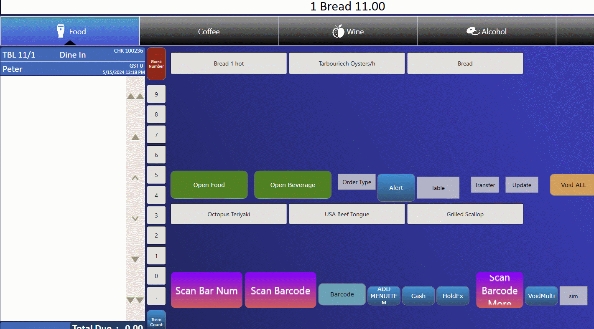

## Void multiple items simple example

example gif.




At the beginning, all items need to be placed in a multiple-choice box for easy selection. Why choose the built-in MultiSelectionRequest here? Because of its additional Select All and Clear All buttons, they are easier to use. Execute void command by selecting item through Command. You must first select it here, otherwise you cannot void the item.

```c#
partial class SimphonyExampleApplication
{
    [ExtensibilityMethod]
    public void Part22Test1()
    {

        Logger.LogAlways("Part22Test1");

        List<OpsSelectionEntry> opsSelectionEntries = new List<OpsSelectionEntry>();

        
        foreach (var item in this.OpsContext.CheckDetail)
        {
            opsSelectionEntries.Add(new OpsSelectionEntry(item.DetailLink, item.Name));
        }

        var voidItems = this.OpsContext.MultiSelectionRequest(Title.VoidMultiMenuItem, Title.VoidMultiMenuItem, opsSelectionEntries);
        if (voidItems == null || voidItems.Count == 0)
            return;

        List<OpsCommand> commands = new List<OpsCommand>();
        foreach (var item in voidItems)
        {
            var voidItem = opsSelectionEntries[item];

            commands.Add(new OpsCommand(OpsCommandType.DetailSelected) { Number = voidItem.Number });
            commands.Add(new OpsCommand(OpsCommandType.Void) { Number = voidItem.Number });
        }

        OpsCommand macroCommand = new OpsCommand(OpsCommandType.Macro)
        {
            Data = commands
        };

        this.OpsContext.ProcessCommand(macroCommand);
    }
}

public enum Title
{
    VoidMultiMenuItem
}
```

